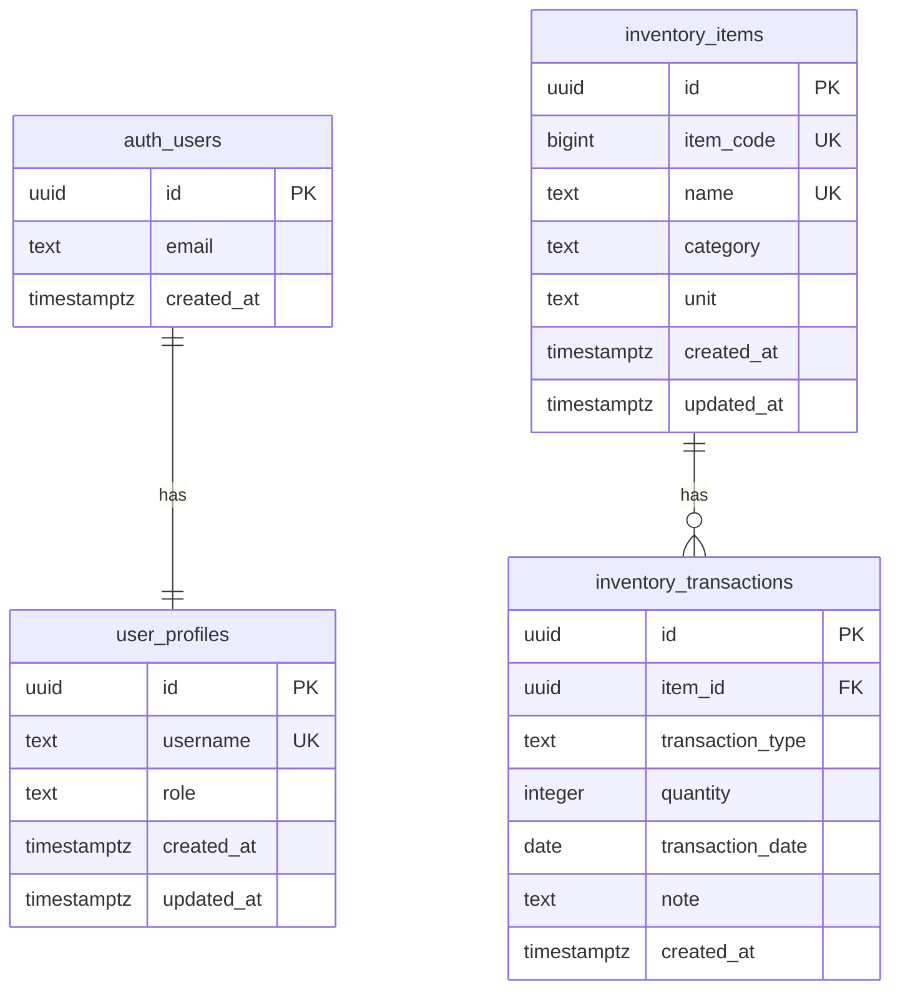

# 在庫管理システム データベーステーブル設計書

## 1. 概要

本書は `docs/design specification/functional_requirements.md` の要件を満たす Supabase PostgreSQL 向けのテーブル設計を定義する。

対象スコープは以下とする。

- 在庫一覧表示
- 入庫登録
- 出庫登録
- 品目マスタ管理
- アカウント作成
- ログイン

本リリースでは、管理者、MG、一般のロール別権限管理を扱う。ユーザー招待、ユーザー承認、入出庫履歴一覧、履歴編集、最低在庫数、カテゴリマスタ、CSV 入出力、複数倉庫、ロット管理は対象外とする。

## 2. 設計方針

### 2.1 在庫数の扱い

現在在庫数は品目テーブルに保持せず、入出庫履歴から以下の式で算出する。

```text
現在在庫数 = 入庫数量合計 - 出庫数量合計
```

これにより、在庫一覧の表示要件「入庫合計 - 出庫合計で算出」を満たし、履歴と現在在庫数の不整合を防ぐ。

### 2.2 更新経路

入庫・出庫登録は Server Action から PostgreSQL 関数（RPC）を呼び出す。特に出庫登録は、現在在庫数を超える出庫を同一トランザクション内で検証してから履歴を登録する。

### 2.3 削除方針

機能要件に従い、品目および入出庫履歴は物理削除とする。品目削除時は `ON DELETE CASCADE` により関連する入出庫履歴も物理削除する。

### 2.4 命名方針

- テーブル名、カラム名は snake_case とする。
- 主キーは UUID とする。
- 品目コードは利用者向けの一意コードとして `item_code` に保持し、システムが自動採番する。
- 日付入力要件が YYYY-MM-DD のため、入出庫日は `date` 型とする。

## 3. ER 図

`auth_users` は Supabase Auth が管理する `auth.users` を表す。



## 4. テーブル一覧

| テーブル名 | 用途 | 主な画面 |
| --- | --- | --- |
| `user_profiles` | ユーザーの表示名と初期権限を管理する | アカウント作成、ログイン後共通 |
| `inventory_items` | 品目マスタを管理する | 在庫一覧、入庫登録、出庫登録、品目マスタ管理 |
| `inventory_transactions` | 入庫・出庫履歴を管理する | 入庫登録、出庫登録、在庫一覧 |

## 5. テーブル定義

### 5.1 `user_profiles`

Supabase Auth のユーザーに紐づくプロフィール情報を管理するテーブル。

| カラム名 | 型 | NULL | デフォルト | 制約 | 説明 |
| --- | --- | --- | --- | --- | --- |
| `id` | `uuid` | 不可 | なし | PK / FK | `auth.users.id` と同一のユーザーID |
| `username` | `text` | 不可 | なし | UNIQUE | 画面上に表示するユーザー名 |
| `role` | `text` | 不可 | `'general'` | CHECK | `admin`、`manager`、`general` のいずれか |
| `created_at` | `timestamptz` | 不可 | `now()` | なし | 作成日時 |
| `updated_at` | `timestamptz` | 不可 | `now()` | なし | 更新日時 |

#### 制約

| 制約名 | 内容 | 目的 |
| --- | --- | --- |
| `user_profiles_pkey` | `primary key (id)` | Supabase Auth ユーザーとの1対1対応 |
| `user_profiles_id_fkey` | `foreign key (id) references auth.users(id) on delete cascade` | Auth ユーザー削除時にプロフィールも削除 |
| `user_profiles_username_key` | `unique (username)` | ユーザー名の一意性担保 |
| `user_profiles_username_not_blank` | `check (btrim(username) <> '')` | 必須項目の空文字防止 |
| `user_profiles_role_check` | `check (role in ('admin', 'manager', 'general'))` | ロールコードの不正値防止 |

#### インデックス

| インデックス名 | 対象 | 用途 |
| --- | --- | --- |
| `user_profiles_username_idx` | `username` | ユーザー名重複確認 |

### 5.2 `inventory_items`

品目マスタを管理するテーブル。

| カラム名 | 型 | NULL | デフォルト | 制約 | 説明 |
| --- | --- | --- | --- | --- | --- |
| `id` | `uuid` | 不可 | `gen_random_uuid()` | PK | 内部識別子 |
| `item_code` | `bigint` | 不可 | IDENTITY | UNIQUE | 品目コード。システム自動採番 |
| `name` | `text` | 不可 | なし | UNIQUE | 品目名。重複不可 |
| `category` | `text` | 可 | なし | なし | カテゴリ。自由入力 |
| `unit` | `text` | 不可 | なし | なし | 単位。自由入力 |
| `created_at` | `timestamptz` | 不可 | `now()` | なし | 作成日時 |
| `updated_at` | `timestamptz` | 不可 | `now()` | なし | 更新日時 |

#### 制約

| 制約名 | 内容 | 目的 |
| --- | --- | --- |
| `inventory_items_pkey` | `primary key (id)` | レコード識別 |
| `inventory_items_item_code_key` | `unique (item_code)` | 品目コードの一意性担保 |
| `inventory_items_name_key` | `unique (name)` | 品目名の重複防止 |
| `inventory_items_name_not_blank` | `check (btrim(name) <> '')` | 必須項目の空文字防止 |
| `inventory_items_unit_not_blank` | `check (btrim(unit) <> '')` | 必須項目の空文字防止 |
| `inventory_items_category_not_blank_when_present` | `check (category is null or btrim(category) <> '')` | 任意項目の空白のみ登録防止 |

#### インデックス

| インデックス名 | 対象 | 用途 |
| --- | --- | --- |
| `inventory_items_item_code_idx` | `item_code` | 在庫一覧のデフォルト表示順 |
| `inventory_items_name_idx` | `name` | 品目名検索 |

### 5.3 `inventory_transactions`

入庫・出庫履歴を管理するテーブル。

| カラム名 | 型 | NULL | デフォルト | 制約 | 説明 |
| --- | --- | --- | --- | --- | --- |
| `id` | `uuid` | 不可 | `gen_random_uuid()` | PK | 内部識別子 |
| `item_id` | `uuid` | 不可 | なし | FK | 対象品目ID |
| `transaction_type` | `text` | 不可 | なし | CHECK | `inbound` または `outbound` |
| `quantity` | `integer` | 不可 | なし | CHECK | 入庫数量または出庫数量。1以上 |
| `transaction_date` | `date` | 不可 | `current_date` | なし | 入庫日または出庫日 |
| `note` | `text` | 可 | なし | なし | 備考 |
| `created_at` | `timestamptz` | 不可 | `now()` | なし | 作成日時 |

#### 制約

| 制約名 | 内容 | 目的 |
| --- | --- | --- |
| `inventory_transactions_pkey` | `primary key (id)` | レコード識別 |
| `inventory_transactions_item_id_fkey` | `foreign key (item_id) references inventory_items(id) on delete cascade` | 品目削除時に関連履歴を物理削除 |
| `inventory_transactions_type_check` | `check (transaction_type in ('inbound', 'outbound'))` | 入出庫区分の不正値防止 |
| `inventory_transactions_quantity_check` | `check (quantity >= 1)` | 数量は1以上の整数 |
| `inventory_transactions_note_not_blank_when_present` | `check (note is null or btrim(note) <> '')` | 任意項目の空白のみ登録防止 |

#### インデックス

| インデックス名 | 対象 | 用途 |
| --- | --- | --- |
| `inventory_transactions_item_id_idx` | `item_id` | 品目別の在庫数集計 |
| `inventory_transactions_item_id_type_idx` | `item_id, transaction_type` | 入庫合計・出庫合計の集計 |
| `inventory_transactions_transaction_date_idx` | `transaction_date` | 将来の履歴検索拡張 |

## 6. ビュー定義

### 6.1 `inventory_stock_summary`

在庫一覧表示用のビュー。品目マスタと入出庫履歴を結合し、現在在庫数を算出する。

| カラム名 | 型 | 説明 |
| --- | --- | --- |
| `item_id` | `uuid` | 品目ID |
| `item_code` | `bigint` | 品目コード |
| `name` | `text` | 品目名 |
| `category` | `text` | カテゴリ |
| `unit` | `text` | 単位 |
| `inbound_quantity` | `bigint` | 入庫数量合計 |
| `outbound_quantity` | `bigint` | 出庫数量合計 |
| `current_quantity` | `bigint` | 現在在庫数 |

#### 想定SQL

```sql
create view public.inventory_stock_summary as
select
  i.id as item_id,
  i.item_code,
  i.name,
  i.category,
  i.unit,
  coalesce(sum(t.quantity) filter (where t.transaction_type = 'inbound'), 0) as inbound_quantity,
  coalesce(sum(t.quantity) filter (where t.transaction_type = 'outbound'), 0) as outbound_quantity,
  coalesce(sum(t.quantity) filter (where t.transaction_type = 'inbound'), 0)
    - coalesce(sum(t.quantity) filter (where t.transaction_type = 'outbound'), 0) as current_quantity
from public.inventory_items i
left join public.inventory_transactions t on t.item_id = i.id
group by i.id, i.item_code, i.name, i.category, i.unit;
```

## 7. RPC / 関数設計

### 7.1 `register_inbound_transaction`

入庫登録用の PostgreSQL 関数。

| 引数 | 型 | 必須 | 説明 |
| --- | --- | --- | --- |
| `p_item_name` | `text` | 必須 | 対象品目名。既存品目名または新規品目名 |
| `p_quantity` | `integer` | 必須 | 入庫数量 |
| `p_transaction_date` | `date` | 必須 | 入庫日 |
| `p_note` | `text` | 任意 | 備考 |
| `p_unit` | `text` | 必須 | 新規品目作成時の単位 |
| `p_category` | `text` | 必須 | 新規品目作成時のカテゴリ |

#### 処理内容

1. `p_item_name` を空白除去し、空でないことを確認する。
2. `p_quantity >= 1` を確認する。
3. 同名品目が存在する場合はその品目IDを使用し、存在しない場合は `inventory_items` に追加する。
4. 新規品目作成時の単位は `p_unit`、カテゴリは `p_category` を使用する。
5. `inventory_transactions` に `transaction_type = 'inbound'` で登録する。
6. 登録した履歴IDを返す。

### 7.2 `register_outbound_transaction`

出庫登録用の PostgreSQL 関数。

| 引数 | 型 | 必須 | 説明 |
| --- | --- | --- | --- |
| `p_item_id` | `uuid` | 必須 | 対象品目ID |
| `p_quantity` | `integer` | 必須 | 出庫数量 |
| `p_transaction_date` | `date` | 必須 | 出庫日 |
| `p_note` | `text` | 任意 | 備考 |

#### 処理内容

1. 対象品目が存在することを確認する。
2. `p_quantity >= 1` を確認する。
3. 現在在庫数を算出する。
4. 現在在庫数が `p_quantity` 未満の場合は例外を返し、履歴を登録しない。
5. `inventory_transactions` に `transaction_type = 'outbound'` で登録する。
6. 登録した履歴IDを返す。

#### 排他制御

同一品目への同時出庫で在庫数が負数にならないよう、関数内で対象品目行に対して `select ... for update` を実行し、品目単位で排他制御する。

## 8. 画面要件との対応

| 要件 | 対応するDB設計 |
| --- | --- |
| 在庫一覧で品目コード、品目名、カテゴリ、現在在庫数、単位を表示 | `inventory_stock_summary` |
| 品目名による部分一致検索 | `inventory_items.name` / `inventory_stock_summary.name` |
| デフォルトは品目コード昇順 | `inventory_items.item_code` |
| 入庫登録で在庫数を加算 | `register_inbound_transaction` により必要に応じて品目を追加し、入庫履歴を登録してビューで加算 |
| 出庫登録で在庫数を減算 | `register_outbound_transaction` により出庫履歴を登録し、ビューで減算 |
| 現在在庫数を超える出庫は登録不可 | `register_outbound_transaction` の同一トランザクション検証 |
| 数量は1以上の整数 | `inventory_transactions.quantity` の CHECK 制約 |
| 日付は YYYY-MM-DD | `inventory_transactions.transaction_date` の `date` 型 |
| 品目コードは自動採番・一意 | `inventory_items.item_code` の IDENTITY + UNIQUE |
| 品目名の重複を許容しない | `inventory_items.name` の UNIQUE |
| 品目削除時に関連履歴も削除 | `inventory_transactions.item_id` の `ON DELETE CASCADE` |
| アカウント作成でユーザー名を保存 | `user_profiles.username` |
| 自己登録ユーザーの初期権限を固定 | `user_profiles.role` の default と CHECK 制約 |
| Auth ユーザーとプロフィールを1対1で紐づける | `user_profiles.id` の `auth.users.id` 参照 |

## 9. RLS / 権限方針

Supabase 利用時は RLS を有効化し、更新系操作は Server Action / Route Handler 経由に集約する。

- `user_profiles` は本人のみ SELECT できる。
- `user_profiles` の INSERT はアカウント作成 Server Action から Service Role キーを使用して行い、クライアントからの直接 INSERT は許可しない。
- `user_profiles.role` の UPDATE は管理者向け Server Action から Service Role キーを使用して行い、クライアントからの直接 UPDATE / DELETE は許可しない。
- 参照は認証済みユーザーに許可する。
- 認証機能の実装完了までは、在庫一覧の参照専用画面を成立させるため `anon` にも `inventory_items`、`inventory_transactions`、`inventory_stock_summary` の SELECT のみを許可する。作成・更新・削除は許可しない。
- 品目および入出庫履歴の作成・更新・削除は Server Action / RPC 経由に集約する。
- クライアントから Service Role キーを使用しない。
- RPC は必要に応じて `security definer` とし、関数内で入力検証と在庫超過検証を行う。

## 10. マイグレーション作成時の注意

- スキーマ変更は `supabase/migrations/*` に SQL として管理する。
- `pgcrypto` 拡張を有効化し、`gen_random_uuid()` を利用する。
- `updated_at` は `user_profiles`、`inventory_items` 更新時に自動更新するトリガーを作成する。
- Server Actions の入力バリデーションは DB 制約に加えて zod でも実施する。
- 品目削除前の確認ダイアログは UI 側の責務とし、DB は `ON DELETE CASCADE` で整合性を保証する。
